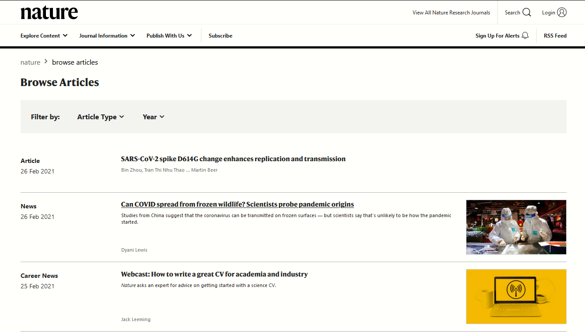

# Nature.com articles Web Scraper

Project page: https://hyperskill.org/projects/145

## About
Nature.com articles scrapping and saving. It features command line interface to specify the article category and number of pages to go through. It then scrapes only the body of the article and saves on disk.

## Learning outcomes
After finishing the project, you’ll know how to send HTTP-requests and process the responses, how to work with an external library, library documentation, and how to use it for parsing the website data. You will also find out how to make your program save results to a file with the help of Python.

## Example

